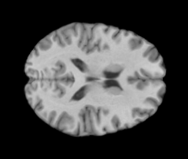
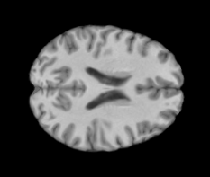
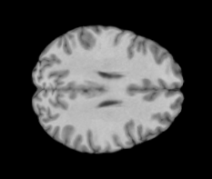

# Brain Extraction, Bias Field Correction & Registration

This repository provides easy to use access for brain-extraction from MRI images. The code consists of the consecutive
applied processing units HD-BET brain extraction tool [1], the SimpleITK N4 Software for bias field correction [2] & the 
Advanced Neuroimaging Tools (ANTs) library for registration the MNI ICBM152 brain atlas.

## Data
The images should be in `'.nii'` format and stored in a folder with the corresponding patient ID (PTID). Hence the 
structure should be as follows:

- `Dataset/`: contains all patient folders
    - `PTID/`: folder containing all images of that patient
      - `image_name.nii`: Head MRI in '.nii' format

## Prerequisites

Python 3.7.2 is used. 

Install ANTsPy through

`pip install https://github.com/ANTsX/ANTsPy/releases/download/v0.2.0/antspyx-0.2.0-cp37-cp37m-linux_x86_64.whl`

Install requirements by running

`pip install -r requirements.txt`.

## Usage

Run the script using: 

`python -m main --data-dir /home/usr/data/ --num_saved_slices 10`.

HD-BET runs on GPU but also has CPU support. Running on CPU takes a lot longer though and you will need quite a bit of RAM. To run on CPU, we recommend you use the following command:

`python -m main --data-dir /home/usr/data/ --num_saved_slices 10 -device cpu`

- The brain_extracted image (no registration and bfc) is saved under `*image_name*_bet.nii.gz`
- The brain extrated + bias field corrected image is saved under `*image_name*_bet_bfc.nii.gz`
- The brain extrated + bias field corrected + MNI152 registered image is saved under `*image_name*_bet_bfc_registered.nii.gz`

The middle MRI Slices are saved to a folder called `slices_*image_name*`. The number of saved middle slices is defined 
through the `--num_saved_slices` flag. When parsing `None`, all slices of the processed `.nii` are saved.

-------------------------------------------
-------------------------------------------

[1] Isensee F, Schell M, Tursunova I, Brugnara G, Bonekamp D, Neuberger U, Wick A, Schlemmer HP, Heiland S, Wick W, 
Bendszus M, Maier-Hein KH, Kickingereder P. Automated brain extraction of multi-sequence MRI using artificial neural 
networks. Hum Brain Mapp. 2019; 1–13. https://doi.org/10.1002/hbm.24750

[2] R. Beare, B. C. Lowekamp, Z. Yaniv, “Image Segmentation, Registration and Characterization in R with SimpleITK”, 
J Stat Softw, 86(8), https://doi.org/10.18637/jss.v086.i08, 2018.

[3] Avants BB, Tustison NJ, Song G, Cook PA, Klein A, Gee JC. A reproducible evaluation of ANTs similarity metric 
performance in brain image registration. Neuroimage. 2011 Feb 1;54(3):2033-44. doi: 10.1016/j.neuroimage.2010.09.025. 
Epub 2010 Sep 17. PMID: 20851191; PMCID: PMC3065962.
